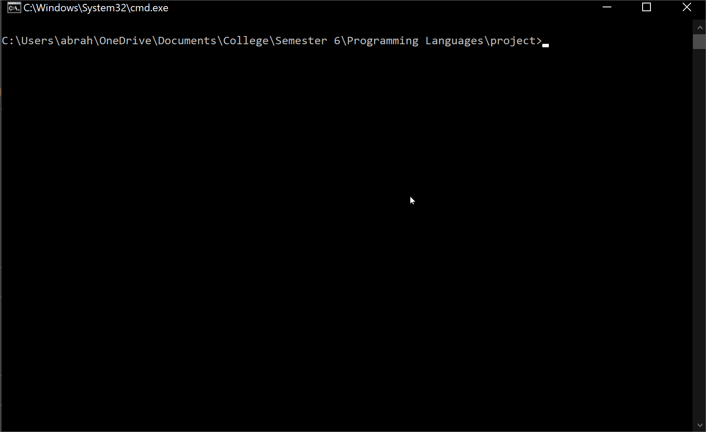
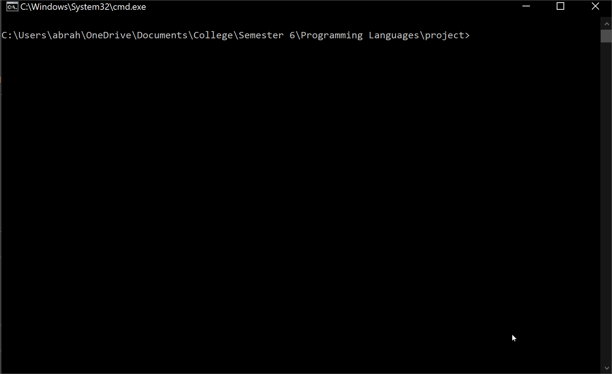
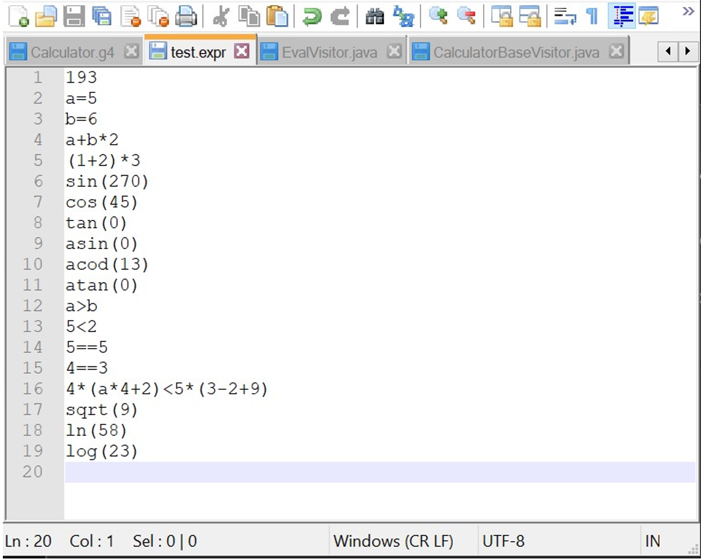
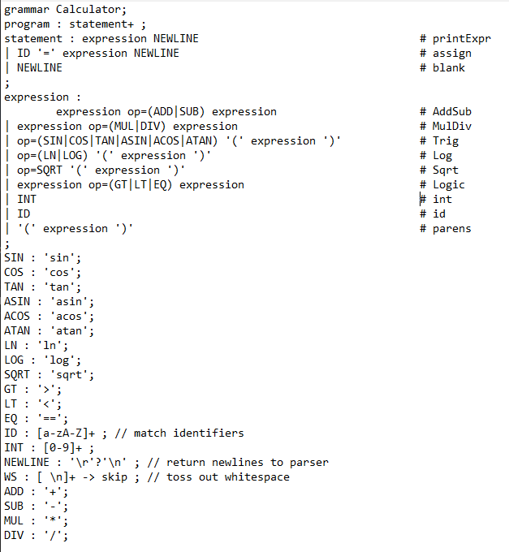

# CommandLineCalculator
A command line calculator created using ANTLR. Eeuations can be inputed while the program is running, or equations can be read from a file.

How to Use
--------------

User Input:
1. Ensure you are within the project folder directory.
2. Run "java Calc"
3. Input an expression and press enter
4. After inputting 1 or more expressions, click ctrl+z to see the results

Read a File Containing Equations:
1. Ensure you are within the project folder directory.
2. Run "java Calc %input-file-name.expr%" to calculate the equations.

Here are the contents inside test.expr

Here is the grammar (syntax) for the calculator input

